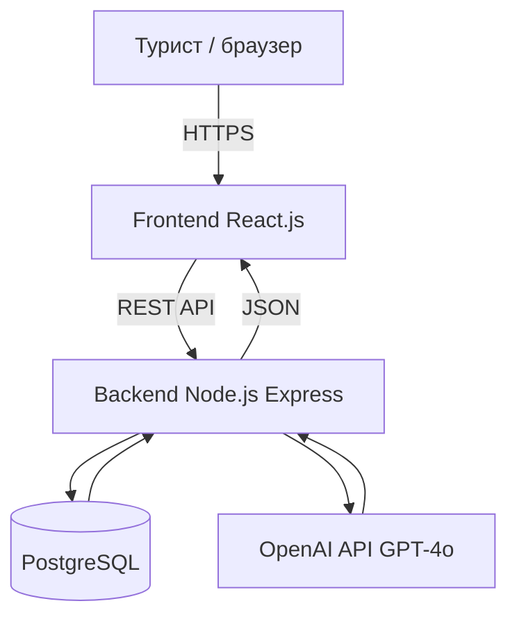

# Технический анализ — Es Al

---

## 1. Стек технологий

| Слой | Технология | Зачем выбрали |
|---|---|---|
| Frontend | React.js | Компонентный подход, быстрая разработка |
| Backend | Node.js (Express) | REST API, быстрый старт, большая экосистема |
| База данных | PostgreSQL | Надёжная реляционная БД, поддержка сложных запросов |
| ИИ-чатбот | OpenAI API (GPT-4o) | Качественные ответы на английском, простая интеграция |
| Аутентификация | JWT + bcrypt | Безопасно, стандарт индустрии, stateless |
| Деплой Frontend | Vercel | Бесплатно, автодеплой с GitHub |
| Деплой Backend | Railway | Бесплатно, PostgreSQL включён |
| CI/CD | GitHub Actions | Автопроверка при каждом push в main |

---

## 2. Архитектура системы

```
[Турист / браузер]
        │
        │ HTTPS
        ▼
[Frontend — React.js]
  Главная · Каталог · Форма брони · ИИ-чат · Авторизация
        │
        │ REST API (JSON)
        ▼
[Backend — Node.js / Express]
  /auth · /regions · /places · /bookings · /chat
        │                        │
        ▼                        ▼
[PostgreSQL]              [OpenAI API]
  users                     GPT-4o
  regions                   Контекст юрты
  places                    Ответы на английском
  bookings
```

### Mermaid-диаграмма



---

## 3. База данных

### Схема таблиц и связи

```
USERS ──────────── BOOKINGS ──────────── PLACES
  id (PK)            id (PK)               id (PK)
  email              user_id (FK)           name
  password_hash      place_id (FK)          type (yurt/topchan)
  full_name          date_from              region_id (FK)
  phone              date_to                price
  created_at         guests_count           capacity
                     total_price            includes_meal
                     status                 includes_horses
                     booking_date           has_playground
                                            contact_phone
REGIONS                                     contact_person
  id (PK)                                   photo_url
  name                                      is_active
```

**Связи:**
- Один `user` → много `bookings`
- Одна `place` → много `bookings`
- Один `region` → много `places`

### SQL-схема

```sql
CREATE TABLE users (
    id SERIAL PRIMARY KEY,
    email VARCHAR(255) UNIQUE NOT NULL,
    password_hash VARCHAR(255) NOT NULL,
    full_name VARCHAR(255),
    phone VARCHAR(50),
    created_at TIMESTAMP DEFAULT NOW()
);

CREATE TABLE regions (
    id SERIAL PRIMARY KEY,
    name VARCHAR(100) UNIQUE NOT NULL
);

CREATE TABLE places (
    id SERIAL PRIMARY KEY,
    name VARCHAR(255) NOT NULL,
    description TEXT,
    type VARCHAR(20) CHECK (type IN ('yurt', 'topchan')),
    region_id INT REFERENCES regions(id),
    location_text VARCHAR(255),
    latitude DECIMAL(10,8),
    longitude DECIMAL(11,8),
    capacity INT,
    price DECIMAL(10,2),
    includes_meal BOOLEAN DEFAULT FALSE,
    includes_horses BOOLEAN DEFAULT FALSE,
    has_playground BOOLEAN DEFAULT FALSE,
    contact_phone VARCHAR(50),
    contact_person VARCHAR(255),
    photo_url TEXT,
    is_active BOOLEAN DEFAULT TRUE
);

CREATE TABLE bookings (
    id SERIAL PRIMARY KEY,
    user_id INT REFERENCES users(id) ON DELETE RESTRICT,
    place_id INT REFERENCES places(id) ON DELETE RESTRICT,
    date_from DATE NOT NULL,
    date_to DATE,
    guests_count INT,
    total_price DECIMAL(10,2),
    status VARCHAR(50) DEFAULT 'confirmed',
    booking_date TIMESTAMP DEFAULT NOW(),
    CONSTRAINT valid_dates CHECK (date_from <= COALESCE(date_to, date_from))
);
```

---

## 4. API-эндпоинты

### Авторизация `/auth`
```
POST   /auth/register     — регистрация нового пользователя
POST   /auth/login        — вход, возвращает JWT-токен
GET    /auth/me           — данные текущего пользователя (protected)
```

### Регионы `/regions`
```
GET    /regions           — список всех регионов
```

### Объекты `/places`
```
GET    /places            — каталог (фильтры: region, type, capacity, price)
GET    /places/:id        — детальная карточка объекта
POST   /places            — добавить объект (только admin)
PATCH  /places/:id        — обновить объект (только admin)
```

### Бронирование `/bookings`
```
POST   /bookings          — создать бронь (protected)
GET    /bookings/my       — мои брони (protected)
PATCH  /bookings/:id      — отменить бронь (protected)
```

### ИИ-чатбот `/chat`
```
POST   /chat              — отправить сообщение, получить ответ ИИ
                            body: { message, place_id?, history? }
```

---

## 5. Требования к безопасности (DevSecOps)

| Категория | Требование | Реализация |
|---|---|---|
| Аутентификация | Все личные эндпоинты защищены | JWT Bearer token в заголовке |
| Пароли | Не хранятся в открытом виде | bcrypt, salt rounds ≥ 10 |
| Секреты | API-ключи не в коде | .env файл + GitHub Secrets |
| CORS | Только разрешённые домены | Whitelist frontend URL |
| Rate limiting | Защита от спама на /chat | Макс. 20 запросов/мин с одного IP |
| SQL-инъекции | Параметризованные запросы | Prepared statements / ORM |
| HTTPS | Весь трафик зашифрован | TLS через Railway и Vercel |
| Валидация | Входные данные проверяются | Middleware на всех эндпоинтах |
